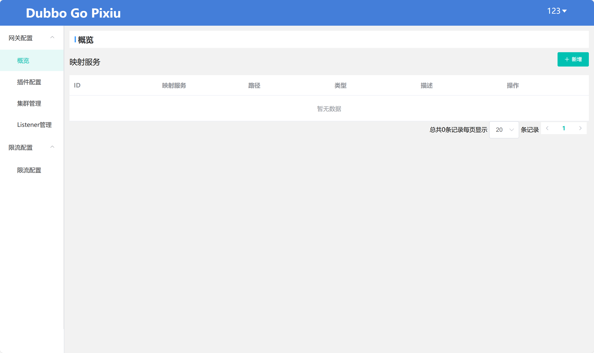

[](http://alexstocks.github.io/html/dubbogo.html)

# Dubbo-Go-Pixiu: A Next-Generation, High-Performance API Gateway

[](https://travis-ci.org/apache/dubbo-go-pixiu)
[](https://codecov.io/gh/apache/dubbo-go-pixiu)
[](https://pkg.go.dev/github.com/apache/dubbo-go-pixiu?tab=doc)
[](https://goreportcard.com/report/github.com/apache/dubbo-go-pixiu)


**English** | [中文](README_CN.md)

-----

**Dubbo-Go-Pixiu** is a high-performance API Gateway built with Go. As a key component of the [Apache Dubbo](https://dubbo.apache.org/) ecosystem, it provides rich traffic management, protocol conversion, and security protection capabilities.


## 🚀 Why Choose Dubbo-Go-Pixiu?

* **High Performance**: Built with Go for low-latency, high-throughput gateway capabilities.
* **Seamless Dubbo Integration**: As the official Sidecar solution, it allows non-Java applications (Go, Python, Node.js, etc.) to easily call Dubbo services.
* **Cloud-Native by Design**: Built for modern microservices and cloud-native architectures, with full support for containerized deployment.
* **Highly Extensible**: A flexible filter and plugin mechanism allows you to easily customize its functionality.

## ✨ We are Evolving into an AI Gateway [WIP]

We are upgrading Pixiu into a **next-generation AI Gateway**, designed to be the bridge connecting users to Large Language Models (LLMs). With Pixiu, you can:

* **Simplify Access**: Access various LLM services in a unified and secure manner.
* **Enhance Capabilities**: Leverage the gateway's powerful plugin system to add features like authentication, observability, and traffic control to your AI applications.
* **Cost-Effectiveness**: Optimize your AI service costs through fine-grained billing, auditing, and caching strategies.

**Try the AI Gateway features now**: Visit our [AI Gateway Samples](https://github.com/apache/dubbo-go-pixiu-samples/tree/main/llm).

## Core Features

| Feature Category      | Description                                                                                                                                              |
| :-------------------- | :------------------------------------------------------------------------------------------------------------------------------------------------------- |
| 🚀 **Protocol Processing** | Supports proxying and mutual conversion between HTTP, gRPC, Dubbo2, and Triple protocols, offering powerful protocol gateway capabilities.        |
| 🛡️ **Security Protection** | Provides multiple security mechanisms like HTTPS, JWT token validation, and OAuth2 to safeguard your services.                                     |
| 🔗 **Service Discovery** | Seamlessly integrates with registries like Zookeeper and Nacos to automatically discover services from Dubbo and Spring Cloud clusters.          |
| ⚖️ **Traffic Governance** | Integrates with Sentinel to provide fine-grained, multi-protocol rate limiting, circuit breaking, and service degradation.                            |
| 📈 **Observability** | Integrates with OpenTelemetry and Jaeger to provide distributed tracing, metrics, and logging.                                                           |
| 🎨 **Visual Management** | The accompanying **Pixiu-Admin** console provides a friendly web UI for remote service management and visual configuration.                              |

## Quick Start

This guide will walk you through starting a Pixiu gateway and accessing a backend Dubbo service via the HTTP protocol.

### Prerequisites

* Go 1.17 or higher.
* Two separate terminal windows.

### Step 1: Get the Pixiu Source Code

In **Terminal 1**, execute:

```shell
git clone https://github.com/apache/dubbo-go-pixiu.git
cd dubbo-go-pixiu
```

### Step 2: Start the Backend Sample Service

In **Terminal 2**, execute:

```shell
git clone https://github.com/apache/dubbo-go-pixiu-samples.git
cd dubbo-go-pixiu-samples/http/simple
# This will start a simple HTTP server as the backend
go run http/simple/server/app/*
```

### Step 3: Start the Pixiu Gateway

Return to **Terminal 1** and start Pixiu with the following command. Please replace `[absolute-path]` with the absolute path to your local `dubbo-go-pixiu-samples` directory.

```shell
go run cmd/pixiu/*.go gateway start -c /[absolute-path]/dubbo-go-pixiu-samples/http/simple/pixiu/conf.yaml
```

When you see logs similar to the following, Pixiu has started successfully and is listening on port `8888`:

```log
2025-05-19T12:46:00.104+0800	INFO	server/pixiu_start.go:127	[dubbo-go-pixiu] start by config : &{StaticResources:{Listeners:[0xc0007b7a20] Clusters:[0xc0007cc5a0] Adapters:[] ShutdownConfig:0xc00067fb30 PprofConf:{Enable:false Address:{SocketAddress:{Address:0.0.0.0 Port:8881 ResolverName: Domains:[] CertsDir:} Name:}}} DynamicResources:<nil> Metric:{Enable:false PrometheusPort:0} Node:<nil> Trace:<nil> Wasm:<nil> Config:<nil> Nacos:<nil> Log:<nil>}
2025-05-19T12:46:00.104+0800	INFO	healthcheck/healthcheck.go:157	[health check] create a health check session for 127.0.0.1:1314
2025-05-19T12:46:00.105+0800	INFO	tracing/driver.go:76	[dubbo-go-pixiu] no trace configuration in conf.yaml
2025-05-19T12:46:00.105+0800	INFO	http/http_listener.go:157	[dubbo-go-server] httpListener start at : 0.0.0.0:8888
```

### Step 4: Send a Test Request

Test the gateway using `curl` or the provided test files:

```shell
# Option 1: Run test files
go test -v ./http/simple/test/

# Option 2: Run the test script using curl
./http/simple/request.sh
```

## Deploying with Docker

We also provide Docker images for quick and easy deployment.

**1. Run Pixiu with Default Configuration**

```shell
docker run --name pixiu-gateway -p 8888:8888 -d dubbogopixiu/dubbo-go-pixiu:latest
```

**2. Run with Custom Configuration Files Mounted**

```shell
docker run --name pixiu-gateway -p 8888:8888 -d \
    -v /your/local/path/conf.yaml:/etc/pixiu/conf.yaml \
    -v /your/local/path/log.yml:/etc/pixiu/log.yml \
    dubbogopixiu/dubbo-go-pixiu:latest
```

For more information, visit the [Pixiu Docker Hub](https://hub.docker.com/r/dubbogopixiu/dubbo-go-pixiu).

## Visual Control Plane: Pixiu Admin

The powerful Pixiu management plane `pixiu-admin` has been [migrated](https://github.com/dubbo-go-pixiu/pixiu-admin) to this repository and can be used for visual configuration of service discovery, traffic management, and security policies.

**Quick Start with Docker Compose:**

```shell
cd /[absolute-path]/dubbo-go-pixiu
docker-compose up -d
```

After starting, you can access the management plane by opening `http://localhost:8080` in your browser.



## Community & Contribution

We warmly welcome all forms of contributions\! Whether it's submitting an issue, proposing a new feature, or contributing code, your participation is vital to the project.

* **Join Our Community**:

Join our discussion group through Ding talk, WeChat, or Discord.

discord https://discord.gg/C5ywvytg


If you like Dubbo-Go-Pixiu, please give us a ⭐ on GitHub\!

## License

This project is licensed under the [Apache License, Version 2.0](LICENSE).